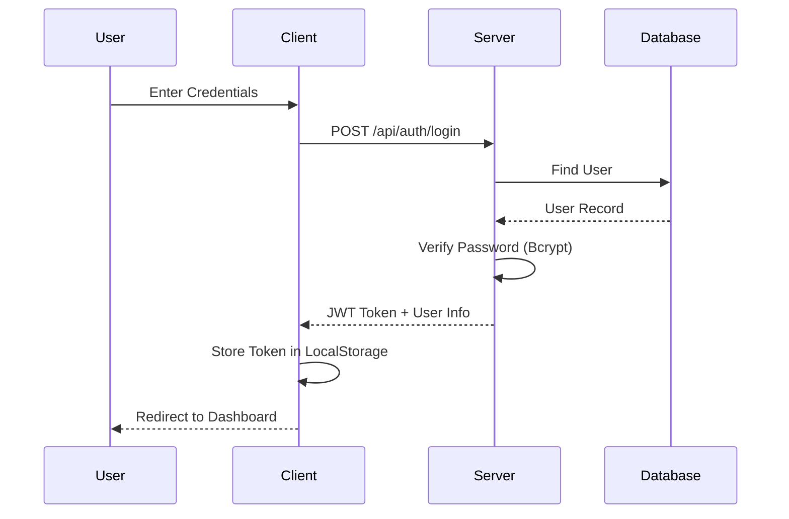
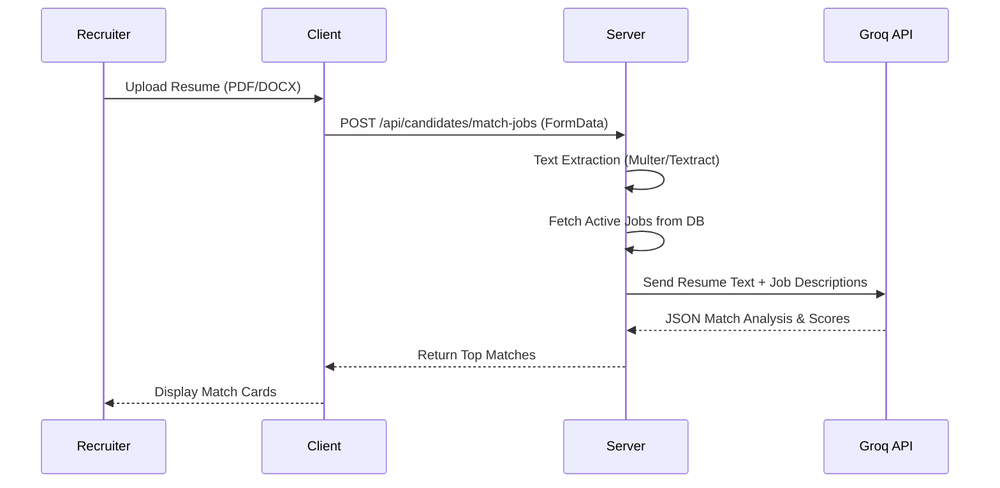
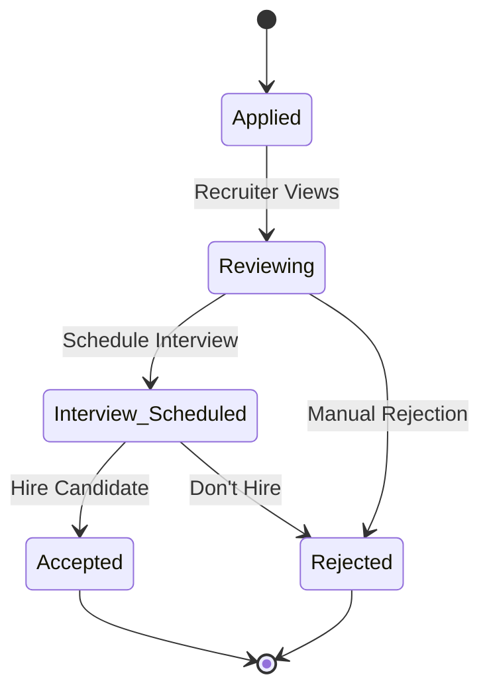

# System Architecture

## Overview
The **AI-Powered Recruitment Tool** is a full-stack web application designed to streamline the hiring process using Artificial Intelligence. It features a modern React frontend and a Node.js/Express backend.

## Tech Stack
- **Frontend**: React, TypeScript, Tailwind CSS, Lucide React, Recharts
- **Backend**: Node.js, Express.js, MongoDB (Mongoose)
- **AI Integration**: Groq API (Llama-3.3-70b for fast inference)

## Data Flow Diagrams

### 1. High-Level Architecture
```mermaid
graph TD
    User[User (Recruiter/Candidate)] -->|HTTPS| Frontend[React Client]
    Frontend -->|REST API| Backend[Node.js / Express Server]
    Backend -->|Queries| DB[(MongoDB Database)]
    Backend -->|Prompt/Response| AI[Groq API (Llama 3)]
    
    subgraph "Backend Services"
        Auth[Auth Service]
        Job[Job Service]
        App[Application Service]
        Match[Talent Matcher]
    end
    
    Backend --> Auth
    Backend --> Job
    Backend --> App
    Backend --> Match
```

### 2. Authentication Flow


### 3. AI Talent Matching Flow


### 4. Application Status Workflow

