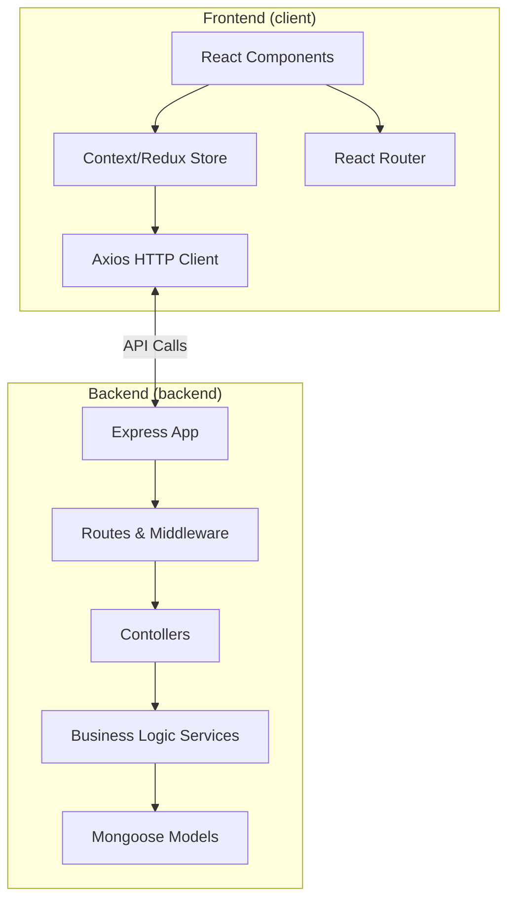
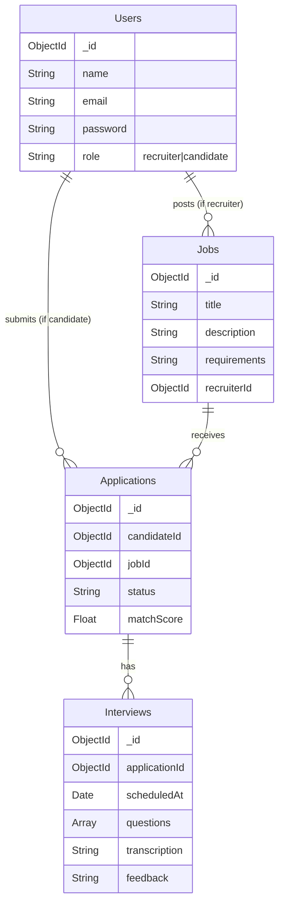
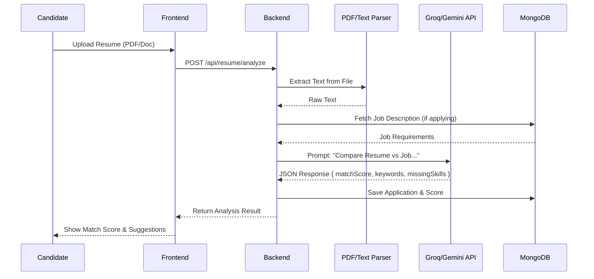
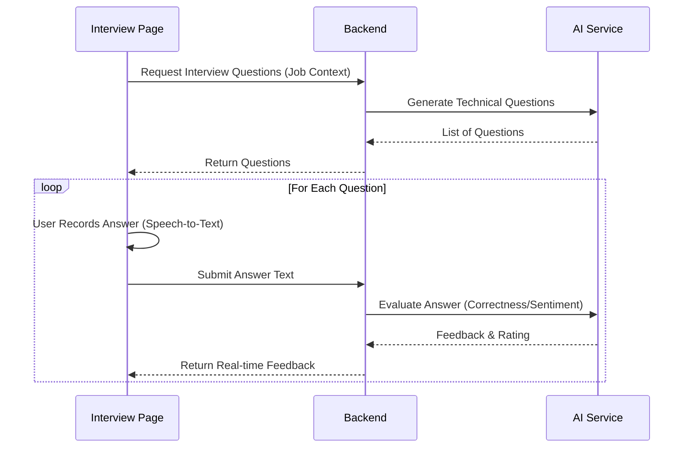

# Comprehensive System Architecture

This document provides detailed architecture diagrams for the AI-Powered Recruitment Tool, generated using Mermaid.js.

## 1. System Context Diagram (High Level)

This diagram portrays the system's interaction with external users and services.

```mermaid
graph TD
    %% Actors
    Candidate[Candidate]
    Recruiter[Recruiter]

    %% Main System
    subgraph "AI-Powered Recruitment Tool"
        WebClient[Frontend Web App (React/Vite)]
        APIServer[Backend API (Node.js/Express)]
        Database[(MongoDB)]
    end

    %% External Services
    Groq[Groq Cloud API<br/>(Llama-3.3-70b)]
    Gemini[Google Gemini API<br/>(Generative AI)]
    Email[SMTP Server<br/>(Nodemailer)]

    %% Relationships
    Candidate -->|Uses| WebClient
    Recruiter -->|Uses| WebClient
    WebClient <-->|HTTPS/JSON| APIServer
    APIServer <-->|Mongoose ODM| Database
    APIServer <-->|Inference Request| Groq
    APIServer <-->|GenAI Request| Gemini
    APIServer -->|Send Emails| Email
```

## 2. Container Architecture

Detailed view of the internal code structure and major libraries.



## 3. Database Schema (ER Diagram)

Conceptual representation of the MongoDB collections.



## 4. Feature Workflows

### AI Resume Matching Logic
This flow explains how the Resume Parsing and Matching engine works.



### AI Interview Assistant Flow
The flow for the interactive interview session.


